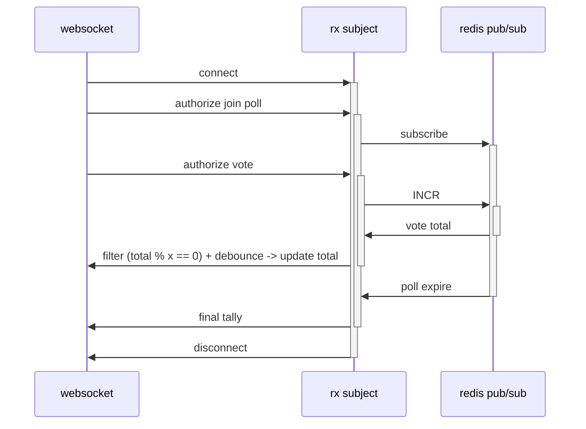

```mermaid
sequenceDiagram
    websocket->>+rx subject: connect
    websocket->>+rx subject: authorize join poll
    rx subject->>+redis pub/sub: subscribe
    websocket->>+rx subject: authorize vote
    rx subject->>+redis pub/sub: INCR
    redis pub/sub->>-rx subject: vote total
    rx subject->>-websocket: filter (total % x == 0) + debounce -> update total
    redis pub/sub->>-rx subject: poll expire
    rx subject->>-websocket: final tally
    rx subject->>-websocket: disconnect
```