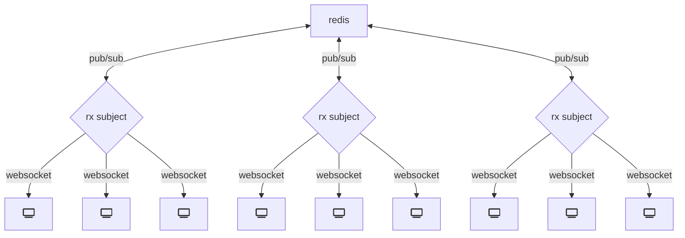
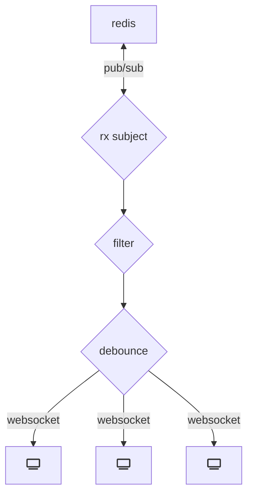

```mermaid
flowchart TD
    A[redis] <-->|pub/sub| B{rx subject}
    B -->|websocket| E[fa:fa-tv]
    B -->|websocket| F[fa:fa-tv]
    B -->|websocket| G[fa:fa-tv]
    A <-->|pub/sub| C{rx subject}
    C -->|websocket| H[fa:fa-tv]
    C -->|websocket| I[fa:fa-tv]
    C -->|websocket| J[fa:fa-tv]
    A <-->|pub/sub| D{rx subject}
    D -->|websocket| K[fa:fa-tv]
    D -->|websocket| L[fa:fa-tv]
    D -->|websocket| M[fa:fa-tv]
```

```mermaid
flowchart TD
    A[redis] <-->|pub/sub| B{rx subject}
    B --> C{filter}
    C --> D{debounce}
    D -->|websocket| E[fa:fa-tv]
    D -->|websocket| F[fa:fa-tv]
    D -->|websocket| G[fa:fa-tv]
```